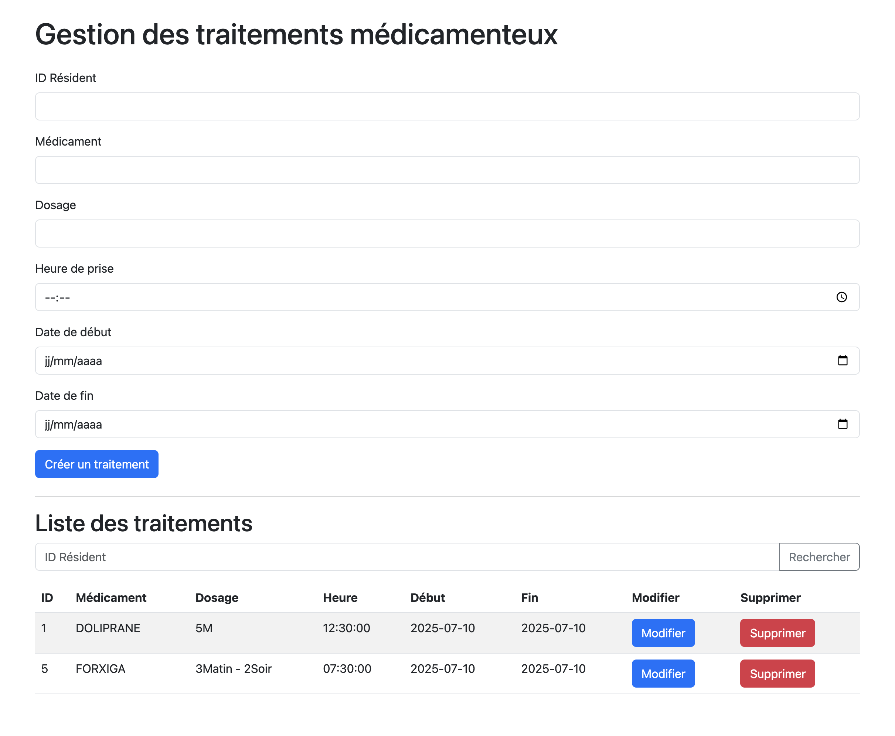

# orisha_socialcare



### Requirements
---

- PHP 8.3-apache
- Apache 2.4
- MySQL 5.7
- Composer 2

### Usage
---

### Installation
---

```
git clone git@github.com:Jonathanlight/orisha-socialcare-test.git
$ cd orisha-socialcar-test

# or start docker containers
$ make docker-run

# install dependencies
$ make docker-exec apache bash
$ composer install

server running on http://localhost:8000
```

### Installation SSl
---
```
cd docker/etc/apache/ssl/

openssl req -x509 -out server.crt -keyout server.key \
-newkey rsa:2048 -nodes -sha256 \
-subj '/CN=localhost' -extensions EXT -config <( \
printf "[dn]\nCN=localhost\n[req]\ndistinguished_name = dn\n[EXT]\nsubjectAltName=DNS:localhost\nkeyUsage=digitalSignature\nextendedKeyUsage=serverAuth")
```

### Configuration
---

- make php-cs-fixer
- make phpstan
- make phpunit

### Pipeline
---

### Authors
---

- Jonathan 